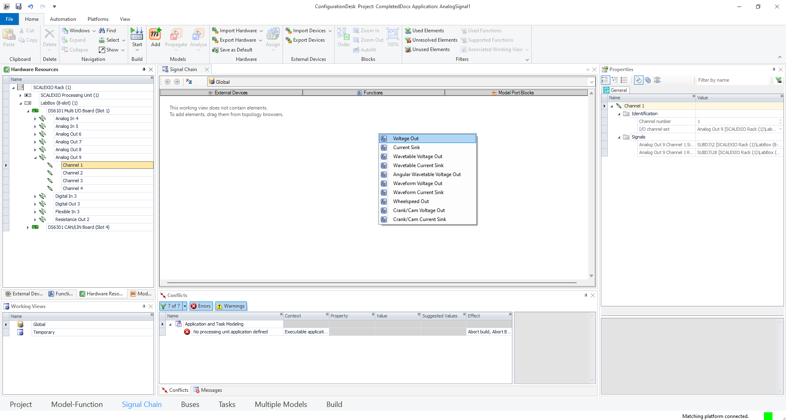
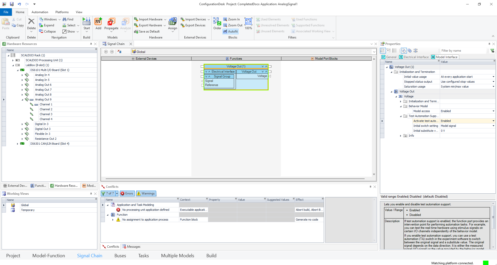
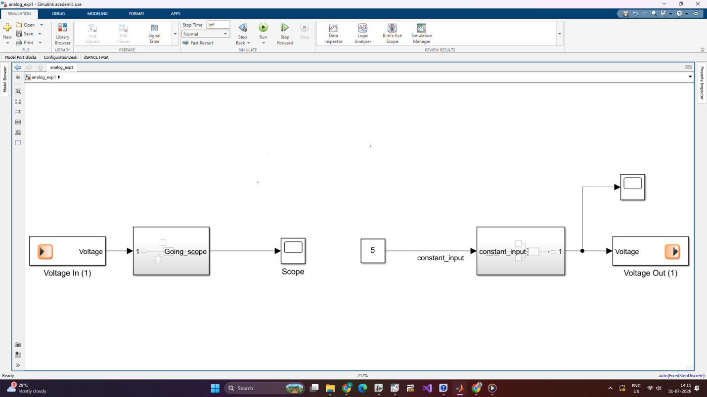
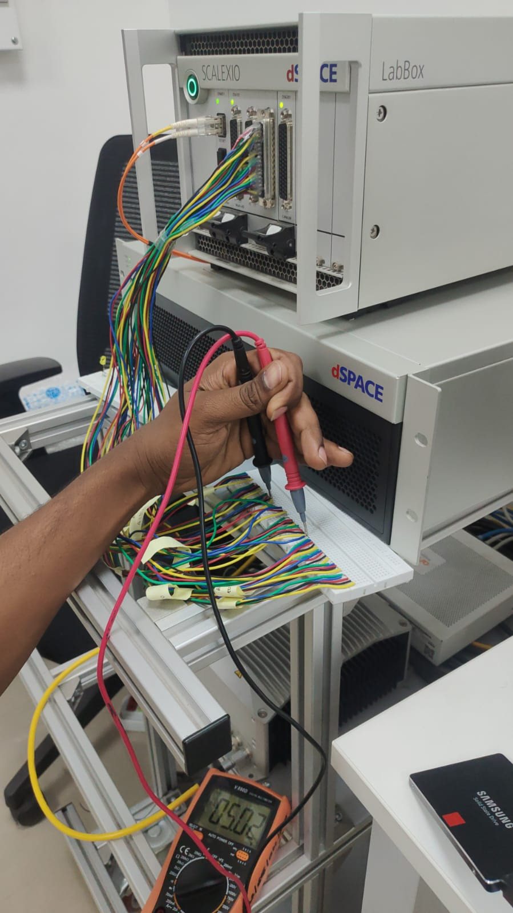
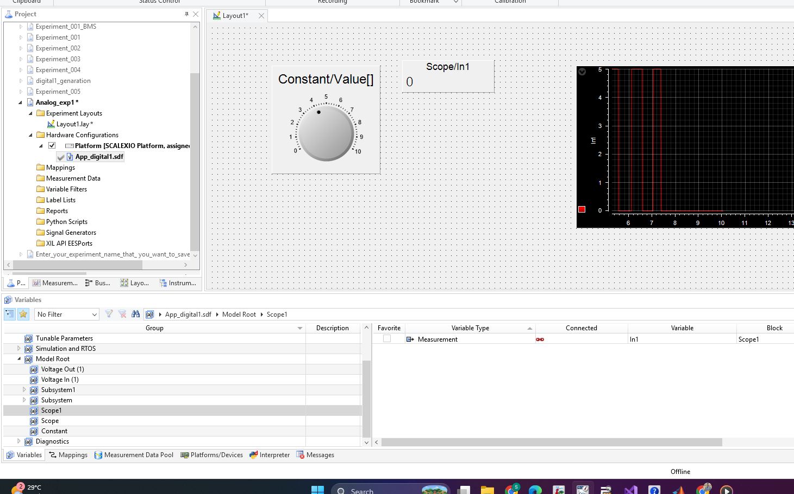
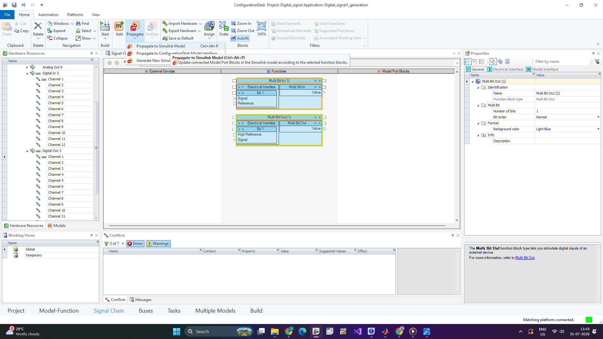
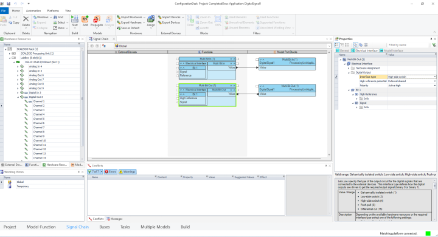
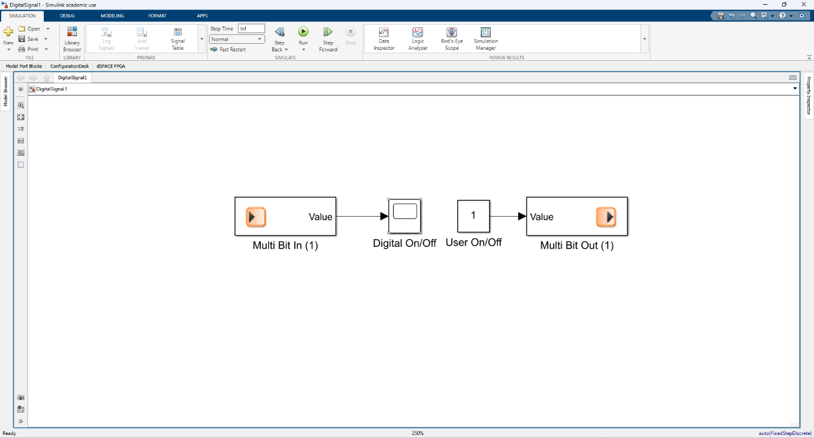
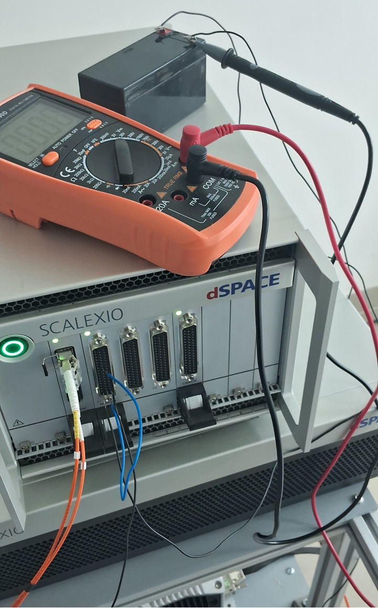
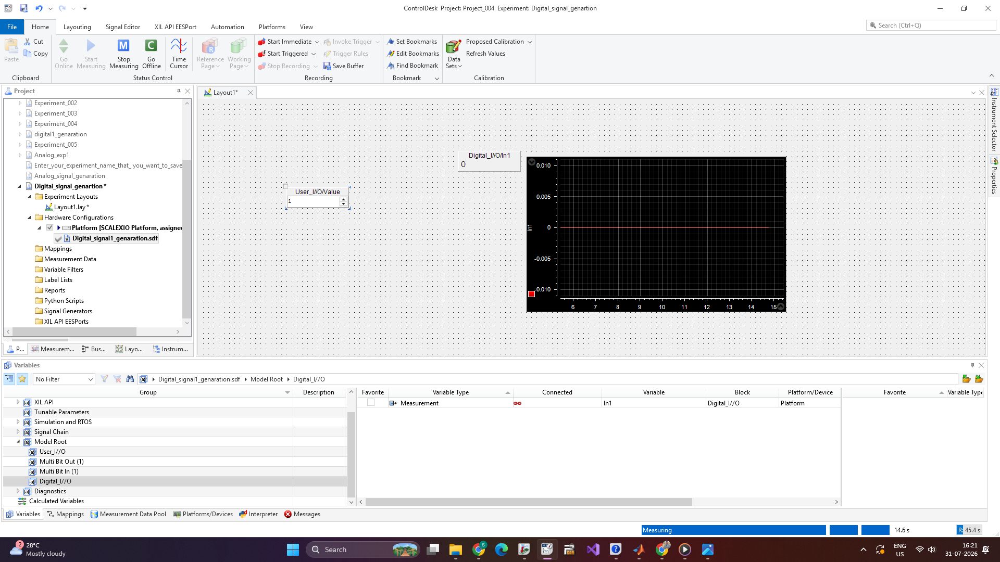

# 🚗 Beginner's Guide: Analog & Digital Signal Generation using dSPACE (HIL Testing)

[](https://uk.mathworks.com/products/simulink.html)
[](https://www.dspace.com/en/pub/home/products/hw/scalexio/scalexio_labbox.cfm)
[](https://www.dspace.com/en/ltd/home/products/sw/impsw/configurationdesk.cfm)
[](https://systemyno.com/dspace-controldesk)

Welcome! This repository is a **beginner-friendly, step-by-step tutorial** for generating and reading **Analog** and **Digital** electrical signals using a **dSPACE SCALEXIO LabBox** with **dSPACE ConfigurationDesk** and **ControlDesk**.

---

## 💡 What is dSPACE & Why Do We Use It? (In Plain English)

In cars, an Electronic Control Unit (ECU / car computer) controls things like the engine, brakes, and headlights by sending and reading electrical signals.

Testing real car computers in actual vehicles can be **expensive and dangerous**. 
**dSPACE** provides a real-time hardware simulator (like the **SCALEXIO LabBox**) that acts as a "virtual car". It sends realistic electrical signals to the car computer and checks how the computer responds — safely inside a lab!

### The 3 Main Tools You Need to Know:
1. 🧠 **MATLAB / Simulink**: Draws the logic and mathematical equations of your controller.
2. ⚙️ **dSPACE ConfigurationDesk**: Connects your Simulink blocks to physical pins on the dSPACE hardware.
3. 📊 **dSPACE ControlDesk**: A visual dashboard with sliders, switches, and gauges to control and view live signals in real time.

```
[ 1. Simulink ]  --->  [ 2. ConfigurationDesk ]  --->  [ 3. ControlDesk ]
  (Build Model)          (Connect Hardware Pins)       (Live Dashboard & Controls)
```

---

## 📂 Quick File Map & Project Directory

Here is where everything is located in this repository:

```
Dspace_HIL_Experiment/
├── 📄 README.md                                             # This Guide
├── 📄 Analog Signal Generation_Dsapce_Documentation.docx    # Full Word Guide for Analog Experiment
├── 📄 Digital Signal Generation dSPACE.docx                 # Full Word Guide for Digital Experiment
│
├── 📂 Analog_signal_genaration/                             # Experiment 1: Analog Signals
│   ├── 📂 Matlab/
│   │   └── 📄 analog_exp1.slx                               # Simulink Model for Analog Signals
│   ├── 📂 Configuration_desk/                               # ConfigurationDesk Setup Files
│   └── 📂 Control_desk/                                     # ControlDesk Dashboard Layout
│
├── 📂 Digital_signal_genaration/                            # Experiment 2: Digital Signals
│   ├── 📂 Matlab/
│   │   └── 📄 Digital_signal_genartion.slx                  # Simulink Model for Digital Signals
│   ├── 📂 Configuration_desk/                               # ConfigurationDesk Setup Files
│   └── 📂 Control_desk/                                     # ControlDesk Dashboard Layout
│
└── 📂 images/                                               # Photos & Screenshots
    ├── 🖼️ analog_image13.jpeg                               # Hardware Wire Connection Photo (Analog)
    ├── 🖼️ analog_image12.png                                # ControlDesk Dashboard Screenshot (Analog)
    ├── 🖼️ digital_image15.png                               # Hardware & Battery Wire Connection Photo (Digital)
    └── 🖼️ digital_image14.png                               # ControlDesk Dashboard Screenshot (Digital)
```

---

## ⚡ Quick Concept Check: Analog vs Digital Signals

* 📈 **Analog Signal**: A continuous, smoothly changing voltage (like a throttle pedal pushed from $0\text{V}$ to $10\text{V}$).
* 🔲 **Digital Signal**: A simple ON/OFF binary switch (`0` = OFF, `1` = ON, like a headlight switch or brake light).

---

## 📈 Experiment 1: Analog Signal Generation & Reading

**Goal**: Generate an analog voltage ($0-10\text{V}$) on a output pin and read it back on an input pin.

### Step 1: ConfigurationDesk Setup
* Select **DS6101 Multi-I/O Board**.
* Set **Analog Out 9** (to output voltage) and **Analog In 4** (to read voltage).

| Select Board | Build Signal Chain |
| :---: | :---: |
|  |  |

### Step 2: Open Simulink Model
* Open [`Analog_signal_genaration/Matlab/analog_exp1.slx`](file:///c:/Users/chall/OneDrive/Desktop/Santhosh-20260731T110706Z-1-001/Santhosh/Dspace_AD_expriment/Dspace_HIL_Experiment/Analog_signal_genaration/Matlab/analog_exp1.slx).
* Connect the pins inside Simulink and click **Build Project** in ConfigurationDesk.



### Step 3: Hardware Wire Connections
Connect jumper wires between the front panel SUBD connectors on your dSPACE SCALEXIO LabBox:
* 🔴 **Signal Wire**: Connect **SUBD3 Pin 2** (Output) $\rightarrow$ **SUBD2 Pin 2** (Input).
* ⬛ **Ground Wire**: Connect **SUBD3 Pin 18** (GND) $\rightarrow$ **SUBD2 Pin 18** (GND).

  
*Hardware Pin Connection for Analog Loopback*

### Step 4: ControlDesk Dashboard
* Open **ControlDesk** and load the generated `.sdf` file.
* Use the slider to change voltage and watch the real-time gauge update live!

  
*Live Analog ControlDesk Dashboard*

---

## 🔲 Experiment 2: Digital Signal Generation & Reading

**Goal**: Toggle a High-Side Digital Switch ON/OFF and verify the input pin detects the signal.

### Step 1: ConfigurationDesk Setup
* Select **DS6101 Multi-I/O Board**.
* Set **Digital Out 3** as a **High-Side Switch**.
* Set **Digital In 3** with a voltage threshold (e.g. $2.5\text{V}$).

| Select Digital Board | Configure High-Side Switch |
| :---: | :---: |
|  |  |

### Step 2: Open Simulink Model
* Open [`Digital_signal_genartion/Matlab/Digital_signal_genartion.slx`](file:///c:/Users/chall/OneDrive/Desktop/Santhosh-20260731T110706Z-1-001/Santhosh/Dspace_AD_expriment/Dspace_HIL_Experiment/Digital_signal_genartion/Matlab/Digital_signal_genartion.slx).
* Wire ports in Simulink and click **Build Project** in ConfigurationDesk.



### Step 3: Hardware & Battery Wire Connections
Digital high-side switches need an external battery power supply:
* 🔴 **Signal Wire**: Connect **SUBD1 Pin 26** (Digital Out 3) $\rightarrow$ **SUBD1 Pin 18** (Digital In 3).
* 🔋 **Battery Positive ($+\text{VB}$)**: Connect **SUBD1 Pin 34** $\rightarrow$ External Battery Positive Terminal.
* ⬛ **Battery Ground ($-\text{VB}$)**: Connect **SUBD1 Pin 1** $\rightarrow$ External Battery Ground Terminal.

  
*Hardware Wiring with External Battery Supply*

### Step 4: ControlDesk Dashboard
* Open **ControlDesk** and load the `.sdf` file.
* Click the toggle switch on your dashboard to turn the signal ON/OFF and observe status LEDs and oscilloscopes in real time!

  
*Live Digital ControlDesk Switching Dashboard*

---

## 🔌 Simple Hardware Pin Reference Table

| Experiment | Wire Type | From (Output) | To (Input / Power) | Purpose |
| :--- | :--- | :--- | :--- | :--- |
| **Analog** | Signal | SUBD3 Pin 2 | SUBD2 Pin 2 | Loops $0-10\text{V}$ voltage output to input |
| **Analog** | Ground | SUBD3 Pin 18 | SUBD2 Pin 18 | Common ground connection |
| **Digital** | Signal | SUBD1 Pin 26 | SUBD1 Pin 18 | Loops digital switch output to input |
| **Digital** | Battery $+$ | SUBD1 Pin 34 | $+\text{VB}$ Battery Terminal | Power supply for high-side switch |
| **Digital** | Battery $-$ | SUBD1 Pin 1 | $-\text{VB}$ Battery Terminal | Common battery ground |

---

## 🔗 Useful Official Links

* 📘 [dSPACE ConfigurationDesk Product Page](https://www.dspace.com/en/ltd/home/products/sw/impsw/configurationdesk.cfm)
* 📙 [Systemyno dSPACE ControlDesk Overview Article](https://systemyno.com/dspace-controldesk)
* 📗 [dSPACE SCALEXIO LabBox Hardware Information](https://www.dspace.com/en/pub/home/products/hw/scalexio/scalexio_labbox.cfm)
* 📙 [MathWorks HIL Testing Guide](https://uk.mathworks.com/discovery/hardware-in-the-loop-hil-testing.html)
